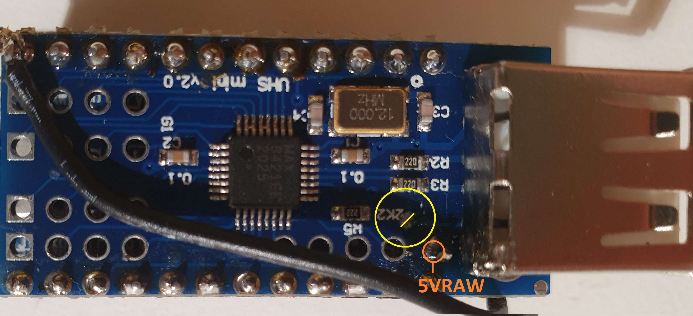
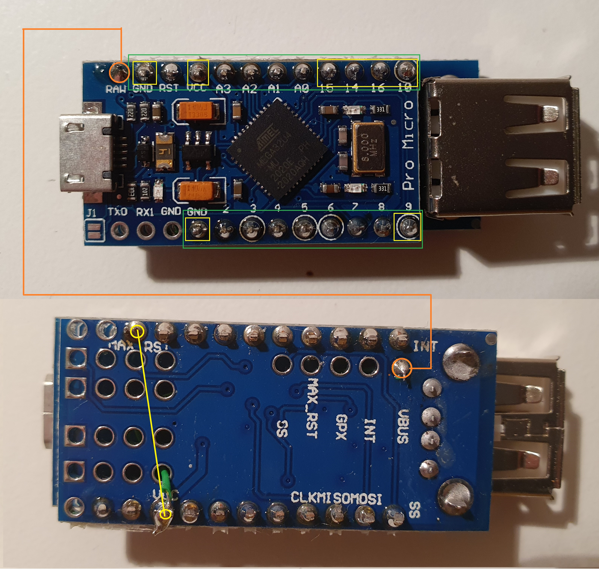

# Setup Hardware
## Step 1

- 1: Take the Mirco UBS Host shield and cut the VBus Wire at the Spot marked in yellow. 
- 2: Solder a new wire to the pin marked in orange. This will be soldered directly to the RAW Pin of the Arduino Mirco

- 3: Solder a wire to the reset pin of the host shield. (yellow circle 3rd from the left).
- 4: solder the pin headers to the Arduino. The yellow marked spots are the pins that have to be connected mandatorily. For convenience, I recommend cutting the pin headers to the length marked in green, as interconnecting the other pins does not hurt and is much faster
- 5: Before soldering the pin headers, solder the new VBus power line added in (2) directly to the RAW port of the Arduino. Leave just enough space, that you can connect the Arduino top to top as seen in the picture.
- 6: Place the host shield onto the pin headers from the Arduino micro.
- 7: solder the added reset cable from (3) to the VCC pin along with the pin from the Pin header. (yellow circle 4th from the left).
- 8: Solder the remaining pins.
